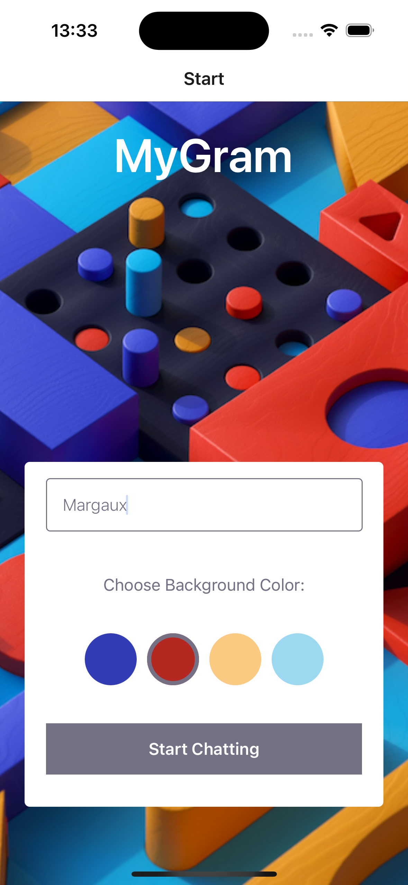
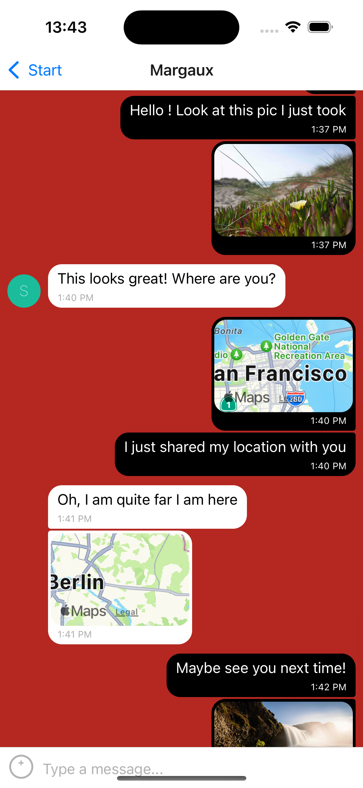

# Chat App

The **Chat App** is a mobile application built with React Native that allows users to communicate in real-time. With features like text messaging, image sharing, and location sharing, the app provides a seamless chatting experience. Developed using Expo and Google Firestore, the Chat App is designed to work on both Android and iOS devices, ensuring users can stay connected wherever they are.

## Features

- **User Authentication**

  - Users can enter the chat anonymously via Google Firebase authentication.

- **Join a Chat Room**

  - A simple interface for users to enter their name and select a background color before joining the chat.

- **Send and Receive Messages**

  - Users can exchange messages in real-time with other chat members.

- **Image Sharing**

  - Users can send images either by selecting from their device's image library or taking a new picture using the camera.

- **Location Sharing**

  - Users can share their current location, displayed in a map view.

- **Offline Access**

  - Users can read their messages offline, allowing them to access conversations anytime.

- **Screen Reader Compatibility**
  - The app is designed to be compatible with screen readers for users with visual impairments

## Tech Stack

- **React Native**: Framework for building mobile applications.
- **Expo**: Development tool for building and deploying React Native apps.
- **Google Firebase**: Database for storing chat messages and user data.
- **Firebase Authentication**: Handles anonymous user authentication.
- **Gifted Chat**: Library for creating the chat interface and functionality.
- **JavaScript (ES2015+)**: Modern JavaScript for handling app logic.
- **CSS/Styled Components**: Stylesheets for responsive design.
- **Testing**: iOS Simulator, Android Emulator, iPhone XR

## Screenshots




## Scenarios (Given-When-Then)

**Feature 1: User Authentication**

- Scenario: User enters a chat room
  - Given the user opens the app
  - When the user enters their name and chooses a background color
  - Then the user should be taken to the chat room.

**Feature 2: Send and Receive Messages**

- Scenario: User sends a message
  - Given the user is in the chat room
  - When the user types a message and clicks send
  - Then the message should appear in the chat.

**Feature 3: Image Sharing**

- Scenario: User sends an image
  - Given the user selects an image from their library
  - When the user clicks send
  - Then the image should be displayed in the chat.

**Feature 4: Location Sharing**

- Scenario: User shares their location
  - Given the user has allowed location access
  - When the user shares their location
  - Then the location should be sent and displayed on a map.

**Feature 5: Offline Access**

- Scenario: User accesses messages offline
  - Given the user has previously opened the app while online
  - When the user opens the app without an internet connection
  - Then the user should be able to read previously received messages.

**Feature 6: Screen Reader Compatibility**

- Scenario: User engages with the chat interface using a screen reader
  - Given the user is using a screen reader
  - When the user navigates through the chat interface
  - Then the screen reader should read aloud the text and buttons.

## Development Status

🚧 This project is under development

## Deployment / Setup the app

Follow these steps to set up and run your chat app.

### Prerequisites

Before you begin, ensure that you have the following software installed on your development machine:

- Node.js (version 16.x or later recommended)
- Expo CLI
- Android Studio (for running on Android emulator)
- Xcode (for running on iOS, macOS only)
- Firebase Project (for real-time messaging and media storage)

### 1. Clone the repository

```
git clone https://github.com/your-username/chat-demo.git
cd chat-demo
```

### 2. Install the Expo CLI

You can install Expo CLI globally by running:

```
npm install -g expo-cli
```

### 3. Install Dependencies

Once inside the project directory, install all necessary packages:

```
npm install
```

### 4. Setup Firebase

1. Create a new project in Firebase Console.
2. Enable Firestore and Firebase Storage for your project.
3. Copy the Firebase configuration from your project and replace the values in the firebaseConfig object inside App.js.

Your firebaseConfig will look something like this:

```
const firebaseConfig = {
  apiKey: "YOUR_API_KEY",
  authDomain: "YOUR_PROJECT_ID.firebaseapp.com",
  projectId: "YOUR_PROJECT_ID",
  storageBucket: "YOUR_PROJECT_ID.appspot.com",
  messagingSenderId: "YOUR_MESSAGING_SENDER_ID",
  appId: "YOUR_APP_ID"
};
```

### 5. Running the App on Emulator or Device

After setting up Firebase, you can run the app on an emulator or a physical device.

- **Android Emulator**: Run the following command to start the app in Android Studio's emulator:

```
npm run android

```

- **iOS Emulator (macOS only)**: Run the following command to start the app in Xcode's iOS simulator:

### Firebase Rules

Make sure to set the proper rules for Firestore and Storage in the Firebase Console:

- **Firestore Rules**:

```
service cloud.firestore {
  match /databases/{database}/documents {
    match /{document=**} {
      allow read, write: if true;
    }
  }
}
```

- **Storage Rules**:

```
service firebase.storage {
  match /b/{bucket}/o {
    match /{allPaths=**} {
      allow read, write: if true;
    }
  }
}
```

### Libraries Used

Here are the main libraries that this app depends on:

React Native - 18.2.0
Expo - 51.0.38
Firebase - 10.3.1
Gifted Chat - 2.6.4
React Native Maps - 1.14.0
Async Storage - 1.23.1
Expo Image Picker - 15.0.7
Expo Location - 17.0.1

## Contributing

Contributions are welcome! Please fork this repository and submit a pull request.

## License

This project is licensed under the MIT License.
